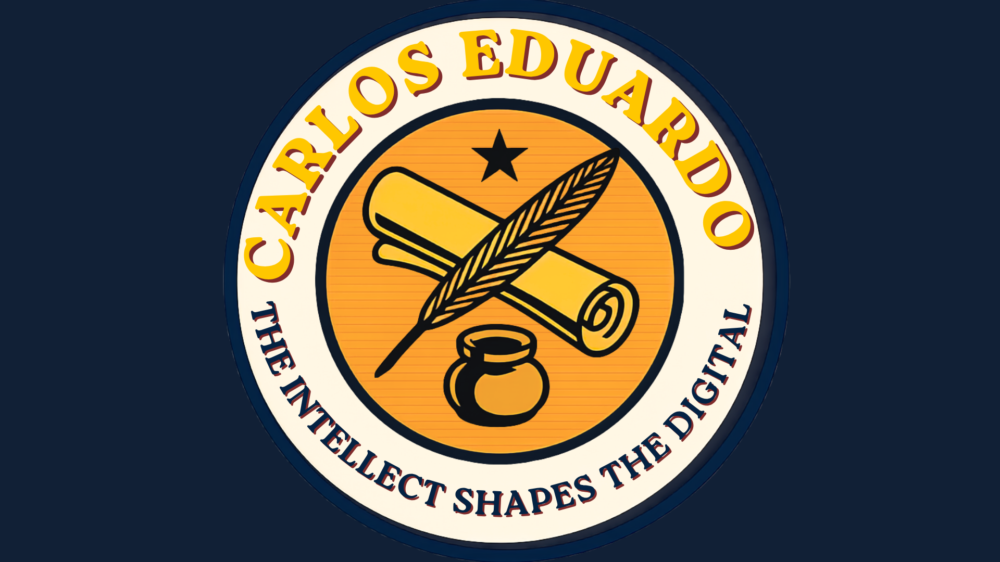

  <a href="README.md" style="color:#F2A31A;">🇧🇷 Português</a> •
  <a href="README-US.md" style="color:#F2A31A;"><b>🇺🇸 English</b></a> •
  <a href="README-ES.md" style="color:#F2A31A;">🇪🇸 Español</a>

  <b> Carlos-Eduardo | Computer Science Student & Software Developer </b>

---

<h2 align="center" style="color: #EA5E26;">📝 About Me</h2>

> <i style="color: #F0ECD7;">"Transforming rigorous logic into practical and scalable software solutions."</i>

I am a Computer Science student with a genuine interest in the fundamentals of technology. Instead of focusing only on the visual layer, I like to go deep and understand the architecture behind systems.

My studies and projects range from <b>web development and relational databases (SQL)</b> to deep analytical concepts involving <b>computer networks and structured algorithms in Java and C++</b>.

I have a knack for step-by-step rigorous technical explanations and always seek to apply this discipline to my code. I am constantly looking to learn, face new challenges, and share knowledge.

---

<h2 align="center" style="color: #EA5E26;">🖥️ Digital Solutions</h2>

---

  

    <b style="font-size: 1.3em; color: #F2A31A;">🧑‍💻 Individual</b>
  

   

  

    

      <b style="font-size: 1.2em; color: #EA5E26;">🏠 Python-Journey</b> &nbsp;
      
    

     
    <blockquote>
      Complete guide with explanations, exercises, and scripts focused on the continuous development of programming logic.
        
      🛠️ <b style="color: #F2A31A;">Stack:</b> <code>Python</code> • <code>VSCode</code> 
      🎯 <b style="color: #F2A31A;">Learning:</b> Deepening in frameworks and improving technical explanation skills. 
      🔗 <a href="https://github.com/Karlos-Eduardo-Mrqs/Python-Journey" style="color: #EA5E26;">Access Repository</a>
    </blockquote>
  

  

    

      <b style="font-size: 1.2em; color: #EA5E26;">⚙️ Operational Works</b> &nbsp;
      
    

     
    <blockquote>
      Repository focused on solving logical problems and varied algorithmic challenges, consolidating knowledge in multiple languages.
        
      🛠️ <b style="color: #F2A31A;">Stack:</b> <code>C++</code> • <code>Java</code> • <code>Python</code> 
      🎯 <b style="color: #F2A31A;">Learning:</b> Optimizing solutions and rigor in compiled languages syntax. 
      🔗 <a href="https://github.com/Karlos-Eduardo-Mrqs/Operational_Works" style="color: #EA5E26;">Access Repository</a>
    </blockquote>  
  

  

    

      <b style="font-size: 1.2em; color: #EA5E26;">🏗️ Construction HTML-Css-Js</b> &nbsp;
      
    

     
    <blockquote>
      Web design and structuring project focused on providing a responsive and interactive user interface.
        
      🛠️ <b style="color: #F2A31A;">Stack:</b> <code>HTML5</code> • <code>CSS3</code> • <code>JavaScript</code> 
      🎯 <b style="color: #F2A31A;">Learning:</b> Mastery of Flexbox, semantic structuring, and event handling via JS. 
      🔗 <a href="https://github.com/Karlos-Eduardo-Mrqs/Construction-Html-Css-Javascript" style="color: #EA5E26;">Access Repository</a>
    </blockquote>
  

  

    

      <b style="font-size: 1.2em; color: #EA5E26;">⚡ Javascript Projects</b> &nbsp;
      
    

     
    <blockquote>
      Collection of my best practical projects focused on Front-End, isolating specific logic in mini-applications.
        
      🛠️ <b style="color: #F2A31A;">Stack:</b> <code>Vanilla JavaScript</code> • <code>HTML</code> • <code>CSS</code> 
      🎯 <b style="color: #F2A31A;">Learning:</b> Programming logic applied directly to the browser and DOM tree manipulation. 
      🔗 <a href="https://github.com/Karlos-Eduardo-Mrqs/Javascript-Projects" style="color: #EA5E26;">Access Repository</a>
    </blockquote>
  

   

---

  

    <b style="font-size: 1.3em; color: #F2A31A;">👥 Teamwork</b>
  

   

  

    

      <b style="font-size: 1.2em; color: #EA5E26;">🌱 Projeto Finança (Spring Boot)</b> &nbsp;
      
    

     
    <blockquote>
      Final college project built on the Java Spring Boot architecture.
        
      🛠️ <b style="color: #F2A31A;">Stack:</b> <code>Java</code> • <code>Spring Boot</code> • <code>HTML</code> 
      🎯 <b style="color: #F2A31A;">Learning:</b> Reading third-party code and understanding the Spring ecosystem and dependency injection. 
      🔗 <a href="https://github.com/Lucas-deAndrade21/Projeto-Financa_SpringBoot" style="color: #EA5E26;">Access Repository</a>
    </blockquote>
  

  

    

      <b style="font-size: 1.2em; color: #EA5E26;">🤖 AI Posture Verifier (ESP32-CAM)</b> &nbsp;
      
    

     
    <blockquote>
      Real-time artificial intelligence assistant that monitors the user's cervical posture and shoulders using a distributed architecture (ESP32-CAM for video streaming and PC for AI processing).
        
      🛠️ <b style="color: #F2A31A;">Stack:</b> <code>Python</code> • <code>C++ (Arduino)</code> • <code>MediaPipe</code> • <code>OpenCV</code> • <code>Tkinter</code> 
      🎯 <b style="color: #F2A31A;">Learning:</b> Integrating embedded systems with Computer Vision, automated mathematical calibration (NumPy), and modular hybrid architecture (Eye-Brain) inside a collaborative workflow. 
      🔗 <a href="https://github.com/VictorLMMartello/Corretor-de-postura-com-ESP32" style="color: #EA5E26;">Access Repository</a>
    </blockquote>
  

  

    

      <b style="font-size: 1.2em; color: #EA5E26;">🏨 Pousada Maré Mansa</b> &nbsp;
      
    

     
    <blockquote>
      Complete hotel management system, built with a focus on clear business rules and MVC (Model-View-Controller) architecture.
        
      🛠️ <b style="color: #F2A31A;">Stack:</b> <code>Python</code> • <code>Tkinter</code> • <code>SQLite</code> 
      🎯 <b style="color: #F2A31A;">Learning:</b> Functional graphical interface integrated with a local relational database. 
      🔗 <a href="https://github.com/Karlos-Eduardo-Mrqs/Pousada-Mare-Mansa" style="color: #EA5E26;">Access Repository</a>
    </blockquote>
  

  

    

      <b style="font-size: 1.2em; color: #EA5E26;">🏥 HealthSched</b> &nbsp;
      
    

     
    <blockquote>
      Clinic scheduling system developed in a collaborative format. The project involves registering patients, doctors, and managing schedules.
        
      🛠️ <b style="color: #F2A31A;">Stack:</b> <code>PHP</code> • <code>HTML</code> • <code>CSS</code> • <code>JavaScript</code> 
      🎯 <b style="color: #F2A31A;">Learning:</b> Team code versioning and merge conflict resolution. 
      🔗 <a href="https://github.com/Karlos-Eduardo-Mrqs/Scheduling_Project-HealthSched" style="color: #EA5E26;">Access Repository</a>
    </blockquote>
  

  

    

      <b style="font-size: 1.2em; color: #EA5E26;">📋 Autumn (Bulletin Project)</b> &nbsp;
      
    

     
    <blockquote>
      School report card system focused on academic organization. Technical course final project where I acted in management and development.
        
      🛠️ <b style="color: #F2A31A;">Stack:</b> <code>PHP</code> • <code>HTML</code> • <code>CSS</code> • <code>phpMyAdmin</code> 
      🎯 <b style="color: #F2A31A;">Learning:</b> Web back-end integration with databases and project life cycle management. 
      🔗 <a href="https://github.com/Karlos-Eduardo-Mrqs/Bulletin_Project" style="color: #EA5E26;">Access Repository</a>
    </blockquote>
  

   

---

<h3 align="center" style="color: #EA5E26;">🛠️ Technologies and Tools</h3>

<b style="color: #F0ECD7;">Languages & Logic:</b>

    

<b style="color: #F2A31A;">Frameworks & Web:</b>

    

<b style="color: #F0ECD7;">Data:</b>

   

<b style="color: #F2A31A;">Systems & Hardware:</b>

<b style="color: #F0ECD7;">Environment & Cloud:</b>

     

---

<h2 align="center" style="color: #EA5E26;">📊 Statistics</h2>

  
  
  

---

  
❝

   
  <i style="font-family: serif; font-size: 1.2em; color: #F0ECD7;">There is no excellence without these things: Elegance. Daring. Preparation. Leadership. Bravery.</i>
    
  
  <b style="color: #F2A31A; font-family: serif; font-size: 1.1em; margin-bottom:-50px;">— Carlos Eduardo</b>

---

  <h3 style="color: #EA5E26;">📬 Let's connect?</h3>

   &nbsp;
   &nbsp;
   &nbsp;
  
  <a href="https://www.linkedin.com/in/carlos-eduardo-marques-barreto-003926389/?locale=en-US">
  

